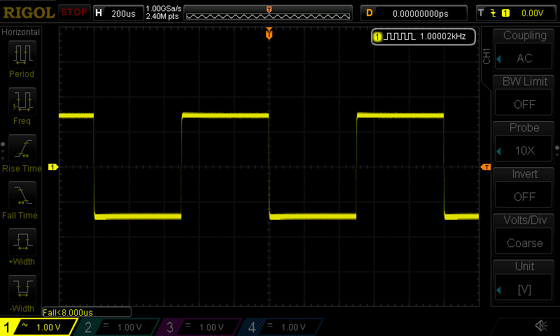

[](https://github.com/pklaus/ds1054z) [](https://pypi.python.org/pypi/ds1054z)

# ds1054z

This package allows you to connect to your Rigol DS1054Z
oscilloscope via Ethernet. It comes with a versatile command line tool.

Off course, you can also use it to control the scope with your own script by using
[the API](https://ds1054z.readthedocs.org/en/stable/api/index.html)
this package has to offer.

While this software is named after the entry level oscilloscope DS1054Z,
I believe there is no reason it wouldn't work with just any scope
of the DS1000Z and MSO1000Z series by Rigol:

* DS1054Z
* DS1074Z
* DS1104Z
* DS1074Z-S
* DS1104Z-S
* MSO1074Z
* MSO1104Z
* MSO1074Z-S
* MSO1104Z-S

## Features

* Discovering your scope via mDNS / DNS-SD
* Saving Screenshots (incl. adjustable dimming of on-screen controls)
* Running / stopping the scope
* Acquiring waveforms
* ... more to come!

## Installation

The installation is dead simple:

    pip install ds1054z[savescreen,discovery]

ds1054z depends on [python-vxi11](https://github.com/python-ivi/python-vxi11)
which should automatically get installed along with itself.


For more information on the installation, please consult the
[installation section][] of the [package documentation][].

**Recommended Firmware**

Older versions of the oscilloscope's firmware have many issues.
The VXI-11 connection could be unstable or commands might return unexpected data.
Specifically, I'm recommending version 00.04.04.SP3 (alias 00.04.04.03.02) published on 2017-02-08.

## Usage


### Command Line Tool

This package installs a versatile command line (CLI) tool called `ds1054z`.
You can use it to save the screen of your scope, for example:

```bash
ds1054z save-screen --overlay 0.6 192.168.0.23
```

As a result, a file like this will be saved to your current working directory:



You can find out more ways to use the CLI tool with `ds1054z --help`
or by reading [the manual](http://ds1054z.readthedocs.org/en/stable/using-the-cli.html).

### Developers

If you're into Python programming, use [the DS1054Z class][]
in your own code:

```python
from ds1054z import DS1054Z

scope = DS1054Z('192.168.0.23')
print("Connected to: ", scope.idn)

print("Currently displayed channels: ", str(scope.displayed_channels))
```

## Author

* Philipp Klaus  
  <philipp.l.klaus@web.de>

## Resources

* This Python package was inspired by [DS1054Z_screen_capture](https://github.com/RoGeorge/DS1054Z_screen_capture).
* The device discovery built into this software is largely based on [this code](https://gist.github.com/MerseyViking/c67b7d6ebdda55929fbd) by [MerseyViking / GeoSpark](https://github.com/MerseyViking).
* There is a Qt4 based GUI interface for the scope called [DSRemote](http://www.teuniz.net/DSRemote/).

[installation section]: https://ds1054z.readthedocs.org/en/stable/installation.html
[package documentation]: https://ds1054z.readthedocs.org/en/stable/index.html
[the DS1054Z class]: https://ds1054z.readthedocs.org/en/stable/api/ds1054z.html
